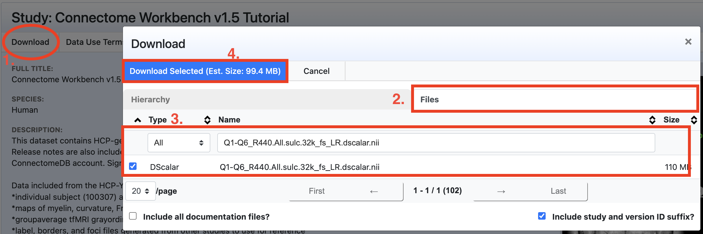
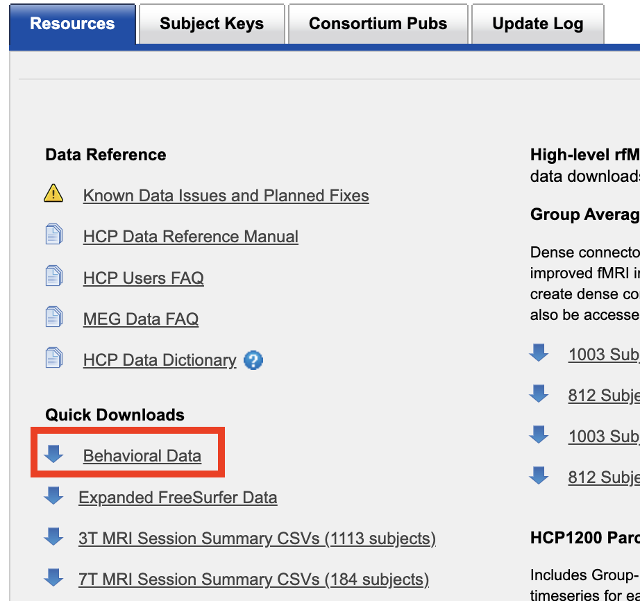
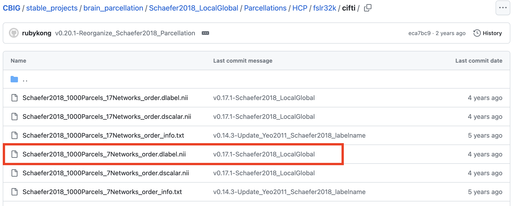

[Link to our paper](https://doi.org/10.1002/hbm.26714)

```{r Introduction Video, echo = FALSE}
vembedr::embed_url("https://youtu.be/PwcKIOFuwX0")
```


# Introducing NEST method

Network Enrichment Significance Testing (NEST) is a powerful approach for evaluating the spatial specificity of brain-phenotype associations within functional brain networks (i.e., *network enrichment*). NEST addresses the need for a more rigorous and replicable framework for testing compared to traditional methods.

#### Quantification and Mapping:

- Quantifying and mapping vertex or voxel-level associations between measurements of brain structure/function and non-imaging phenotypes is central to many neuroimaging studies.

- We often refer to canonical functional networks to interpret what it means for associations to be strong/weak in different parts of the brain.  
    - Helps understand neural mechanisms in transdiagnostic psychopathology.  

    - Evaluates the strength or enrichment of brain-phenotype associations within networks.  


```{r, echo=FALSE, out.width='80%', fig.align='center', fig.cap='Many neuroimaging studies involve interpreting maps of brain-phenotype associations through the lens of functional networks, but null hypotheses haven’t been well-defined, and methods are often ad hoc or rely on strong assumptions.​​'}
knitr::include_graphics("imgs/intro1.png")
```


#### Challenges with Traditional Methods:

- Some methods have relied on subjective interpretations and unrealistic assumptions.

- Newer, more methodical approaches (e.g., spin test) may have inflated false positive rates. 

#### NEST:

- Addresses gaps in existing methods

- General approach: adapts GSEA (Subramanian et al., 2005) to neuroimaging setting

    - Compares observed enrichment scores to a permutation-based null distribution to get a *p*-value 

    - In a typical GSEA, researchers correlate mRNA expression profiles for many genes with a phenotype. In this setting, the null hypothesis ($H_0$) is that the correlations for genes in a pre-specific set are no higher than for genes outside that set.
    

- NEST null hypothesis: brain-phenotype associations observed *within* a network of interest are *no more extreme* than those observed *outside* the network.  

    - Small *p*-values $\implies$ evidence for enrichment within the network  

- By adapting GSEA to the neuroimaging context through NEST, we can more accurately test the specificity of brain-phenotype associations to functional networks without compromising the spatial integrity of the data, which is a problem in previous methods.
    
<!--
## Gene Set Enrichment Analysis (GSEA)

The idea for NEST comes from one of the most widely used methodologies in genomics research, gene set enrichment analysis (GSEA)​.


Brief Overview:

- Sorting Correlations: The correlations are sorted in descending order, with positive correlations at the top and negative correlations at the bottom. The enrichment score ($ES$) quantifies the extent to which genes in the set appear at the top or bottom of the list.

- Null Distribution: The null distribution is obtained by calculating the ES after permuting the samples (i.e., subjects).

```{r, echo=FALSE, out.width='80%', fig.align='center', fig.cap='Gene Set Enrichment Analysis (GSEA) - Subramanian et al. (2005)​​'}
knitr::include_graphics("imgs/intro2.png")
```
-->

#### Steps in the NEST Method:

<!-- - Accurately tests the specificity of brain-phenotype associations to functional networks. -->

<!-- - Maintains the spatial integrity of the data. -->


```{r, echo=FALSE, out.width='80%', fig.align='center', fig.cap='Illustration of NEST, which adapts GSEA to test network enrichment in brain-phenotype association studies.​​'}
knitr::include_graphics("imgs/nest.png")
```

1. Quantify Associations:

    - Measure brain-phenotype associations at each location.

    - The choice of measurement method is flexible (e.g., partial correlation, regression coefficient estimates).


2. Sort Associations:

    - Arrange the brain-phenotype associations in descending order.

    - Locations with the strongest positive associations are at the top, and those with the strongest negative associations are at the bottom.

3. Identify Network-Specific Associations:

    - Identify the associations that fall within the pre-specified network of interest.

4. Calculate Running Sum:

    - Start with a running sum initialized to zero.

    - Update the running sum as you go through the sorted list.

5. Compute Enrichment Score:

    - Determine the enrichment score based on the maximum deviation from zero observed in the running sum.

6. Perform Permutations:

    - Shuffle the phenotype data across individuals multiple times.

    - For each permutation, repeat the steps of quantifying and sorting associations, and calculating the enrichment score.

7. Estimate p-value:

    - Compare the observed enrichment score to those obtained from permutations.

    - Estimate a p-value to evaluate the significance of the enrichment.
    
<!-- Comment on why this null distribution makes sense​
When we permute the phenotype across people, we’re destroying any real association between the image and the phenotype throughout the image​
So when we sort the association metrics, network members shouldn’t be more likely to appear at the top/bottom of that list, and the enrichment scores in the null setting would be deflated relative to a setting where there really is enrichment -->


# Implementations in R

The implementation of NEST is open-source and available in both R and Python. Researchers can easily use NEST by installing the ready-to-use package through `devtools::install_github()` in R or `pip` in Python. We hope this will allow researchers to easily apply NEST in their studies!

The following is a step-by-step guide for implementing NEST in R.

## Install the package

```{r}
if (!require(devtools)){
  install.packages("devtools")
}
devtools::install_github("smweinst/NEST")
library(NEST)
```

## Prepare the data

Import necessary libraries for NEST:  
- `parallel` for efficient parallel computing across multiple processor cores or machines to speed up computations.

```{r}
library(parallel)
library(NEST)
```


Data used in our paper is publicly available in raw format [here](https://www.ncbi.nlm.nih.gov/projects/gap/cgi-bin/study.cgi?study_id=phs000607.v3.p2).

For the purpose of this software demonstration, we will illustrate NEST using publicly available preprocessed data from the HCP. This open access dataset has been made freely available to the research community by the [WU-Minn HCP consortium](http://www.humanconnectome.org/).

Connectome workbench can be downloaded [here](https://www.humanconnectome.org/software/get-connectome-workbench).

HCP Tutorial data V1.5 can be downloaded [here](https://balsa.wustl.edu/study/kN3mg) and behavioral data can be downloaded [here](https://db.humanconnectome.org/data/projects/HCP_1200), account required for both data.

Network partition labels can be found [here](https://github.com/ThomasYeoLab/CBIG/tree/master/stable_projects/brain_parcellation/Yeo2011_fcMRI_clustering/1000subjects_reference/Yeo_JNeurophysiol11_SplitLabels/fs_LR32k).


```{r, echo=FALSE, out.width='80%', fig.align='center', fig.cap='Workbench can be downloaded [here](https://www.humanconnectome.org/software/get-connectome-workbench)​.​'}
knitr::include_graphics("imgs/workbench.png")
```

```{r, echo=FALSE, out.width='80%', fig.align='center', fig.cap='Brain-imaging data can be downloaded [here](https://balsa.wustl.edu/study/kN3mg)​.​'}

```

```{r, echo=FALSE, out.width='40%', fig.align='center', fig.cap='Behavioral data can be downloaded [here](https://db.humanconnectome.org/data/projects/HCP_1200).​​'}

```

```{r, echo=FALSE, out.width='80%', fig.align='center', fig.cap='Network partition data can be downloaded [here](https://github.com/ThomasYeoLab/CBIG/tree/master/stable_projects/brain_parcellation/Schaefer2018_LocalGlobal/Parcellations/HCP/fslr32k/cifti).'}

```

Once we get data ready, we will load them in R:

- Brain imaging data (e.g., freesurfer or cifti data) is loaded


```{r}
library(ciftiTools)
wb_path <- "/Users/binli/Documents/workbench/bin_macosxub" # specify your own path
ciftiTools.setOption("wb_path", wb_path)
cifti <- read_cifti("./data/Q1-Q6_R440.All.sulc.32k_fs_LR.dscalar.nii")
sample_list <- cifti$meta$cifti$names
id_list <- sub("_Sulc","", sample_list)
X <- t(rbind(cifti$data$cortex_left, cifti$data$cortex_right))
print(dim(X))
# Visualize the CIFTI data
view_xifti_surface(cifti)
```


- Load phenotype of interest (y) and covariates (Z) 

```{r}

behavior <- read.csv("./data/behavioral.csv", row.names="Subject")

sex <- ifelse(behavior[id_list,"Gender"] == "F", 0, 1)
age <- factor(behavior[id_list,"Age"], levels = unique(behavior$Age), ordered = T)
print(length(sex))
print(length(age))

```

 
- A list (`net`) of one or more vectors is created for network(s) of interest (e.g., `net_7` indicates vertex membership in the default mode network)  


```{r}
net_data <- read_cifti("./data/Yeo2011_7Networks_N1000.dlabel.nii")
# names(net$data)
yeo_7 <- t(rbind(net_data$data$cortex_left, net_data$data$cortex_right))

print(yeo_7)
dim(yeo_7)
unique(c(yeo_7))
```


```{r}
net <- list(
  Default = as.integer(yeo_7 == 7) 
)

zero_indices <- which(yeo_7 == 0)
X <- X[,-zero_indices]

net$Default <- net$Default[-zero_indices]
dim(X)
length(net$Default)
```

After loading the data, we recommend checking that the dimensions of your input data are correct:

- dimension of `X` should be N x P (number of participants x number of image locations)

- dimension of phenotype vector `y` should be N

- dimensions of covariate/confounder vector or matrix `Z` should be N (x however many covariates you're adjusting for)


## Define the arguments.

The following dictionary of arguments are defined to passed to the nest method. 
The args can be defined as follows, assuming vertex-wise linear models will be fit to estimate local brain-phenotype associations (i.e., specifying statFun=“lm” in step 4.).

- `X`: N x P matrix of P imaging features (e.g., vertices) for N
  participants
- `y`: N-dimensional vector of the phenotype of interest (i.e., testing
  enrichment of X-y associations).
- `Z`: Optional. Specify one or more covariates (matrix with N rows and q
  columns for q covariates). Default is NULL (no covariates to be
  included).
- `FL`: Optional. Default is FALSE, set to TRUE to use the Freedman-Lane
  procedure to account for dependence between covariates in permutation.
- `n.perm`: Optional. Default is 999, with the smallest possible p-value
  of 1/1000.

```{r}
args.lm <- list(
    X = X, # brain measurements (dimension N subjects x P image locations)
    y = sex, # phenotype of interest (dimension N)
    Z = age, # covariates (dimension (N x # number of covariates)
    type = "coef", # what type of test statistic to extract from linear regression model (note: if using a different type of model for statistic, this may be different. see source code)
    n.perm = 999 # how many permutations to use to obtain null distribution
)
```
Note: non-linear regression-based statistics can also be used. This example is just for the regression-based statistic.

## Apply the NEST method 

Arguments for NEST function: 
- `statFun`: specify the method to get vertex-level test statistics (e.g., "lm"). Must correspond to a statFun R script (e.g., statFun.lm.R or statFun.gam.mvwald.R, or another one customized by the user)

- `args`: arguments needed for whatever was specified as statFun

- `net.maps`: list of binary vector(s) indicating locations inside (1) or outside (0) network(s) of interest.

- `one.sided`: Specifies whether test is one-sided (`one.sided=TRUE`) or two-sided (`one.sided = FALSE`)
    - In a one-sided test, we test whether T(v) are *more extreme* in vs. outside the network
    - In a two-sided test, we test whether the distribution of T(v) is *different* in vs. outside the network.
    - Note: default is `one.sided = TRUE`, which is consistent with implementation used in the paper.

- `n.cores`: specify the number of CPU cores to be employed for parallel processing tasks within the function. Default is `n.cores = 1` but increase for speedier computation time.  

- `seed`: random seed for reproducible permutation. Default is `NULL`, but we recommend setting one.

- `what.to.return`: specify what values to return. `"everything"` will include p-value, enrichment score, null distribution, etc. If left unspecified, the default is to return only the p-value for each network.
```{r,eval=FALSE}
out <- NEST(statFun = "lm",
            args = args.lm, # arguments defined above (specific to statFun="lm" setting)
            net.maps = net, 
            one.sided = TRUE,
            n.cores = 1, 
            seed = 10, 
            what.to.return = "everything")

```


```{r, eval=FALSE}
out$ES
out$pval
```

# Implementations in Python

## Prepare the data

import necessary libraries for loading the data:
- nibabel for reading and writing neuroimaging data. 
- numpy for numerical operations and array handling.

```{Python}

import nibabel as nb
import numpy as np

```

The following codes loads and preprocesses the brain imaging data and phenotype (e.g., demographic) information:

- Brain imaging data (cifti_data) is loaded from a .nii file.
- Network labels (network_label) are loaded and filtered to remove unspecified indices (-1).
- Binary vectors (net_7) are created for two specific networks, indicating vertex membership.
- Phenotype data (age, sex) is loaded and combined into a single array (phenotype).

```
# load brain imaging data
cifti_data = nb.load('./Dataset/HCP_WB_Tutorial_1.0/Q1-Q6_R440.All.sulc.32k_fs_LR.dscalar.nii').get_fdata(dtype=np.float32) # (replace with code to load your data)
network_labels = np.load('./Dataset/network_label_yeo7.npz')['arr_0'] # (replace with code to load your network labels)

idx = network_labels!=-1  # identify which locations should be ignored (e.g., medial wall)
network_label = network_labels[idx]  # remove labels outside idx
X = cifti_data[:,idx] # subset image (X) locations to idx

# generate binary vector for each network, 0-> specific vertex does not belong to the network, 1-> specific vertex belongs to the network.
net_7 = np.where(network_label!=7,0,1)  # create a binary vector with 1's at locations corresponding to network 7 and 0's at locations outside network 7

# Phenotype of interest (y) and covariates (Z)
y = np.load('./Dataset/R440_age.npz')['arr_0'] # replace with code to load your phenotype (e.g., age)
Z = np.load('./Dataset/R440_gender.npz')['arr_0'] # replace with code to load other covariates/confounders (e.g., sex)
```

## Import the NEST package
The package can be installed via 'pip install nest-sw'

```
from NEST import nest
```


## Specify the auguments

Define the following dictionary of arguments passed to the nest method. 
The args can be defined as follows, assuming vertex-wise linear models will be fit to estimate local brain-phenotype associations (i.e., specifying statFun='lm' in step 4.).

- `X`: N x P matrix (numpy array) of P imaging features (e.g., vertices) for N participants.

- `y`: N-dimensional vector of phenotype of interest (i.e., testing enrichment of X-y associations).

- `Z`: Optional. Specify one or more covariates (matrix with N rows and q columns for q covariates). Default is NULL (no covariates to be included).

- `FL`: Optional (default is False). Set to True to use Freedman-Lane procedure to account for dependence between covariates in permutation.

- `n_perm`: Optional (default is 999, with smallest possible p-value of 1/1000).

```
args = {
    'X': X, # brain measurements (dimension N subjects x P image locations).
    'y': y, # phenotype of interest (dimension N).
    'Z': Z, # covariates (dimension (N x # number of covariates).
    'type': 'coef', # what type of test statistic to extract from linear regression model.
    'FL': False, # Not use Freedman-Lane procedure.
    'n_perm': 999 # how many permutations to use to obtain null distribution.
}
```


## Apply the NEST method

NEST method can be called through the function nest() with specified auguments.

```
pval,ES_obs,ES_null,_ = nest(statFun='lm', # use linear regression to get vertex-level test statistics
                             args=args, # arguments specified above (specific to statFun="lm")
                             net_maps=net_7, # list of binary indicating locations inside (1) or outside (1) network(s) of interest. just for one network, but could be for multiple
                             one_sided=True, # Determines whether the enrichment score calculation should consider only the positive alignment (True) or both directions (False).
                             seed=None, # Random seed for reproducible permutation. Default is None. 
                             )
```


NEST also supports the use of customized statistical functions for calculating associations. 
This advanced feature allows for more tailored analysis that fits specific research questions or datasets. 
To utilize a custom statistical function, specify the argument `statFun = 'your_custom_function'` alongside the corresponding arguments required by your function.


# Additional resources

Tutorial for using NEST in Python is available at [here](https://github.com/smweinst/NEST/blob/main/Python/example.ipynb).

More information: [here](https://smweinst.github.io/nest-method/)

Feel free to reach out with any comments/questions!
