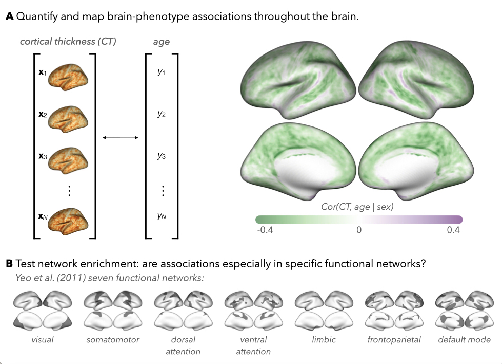
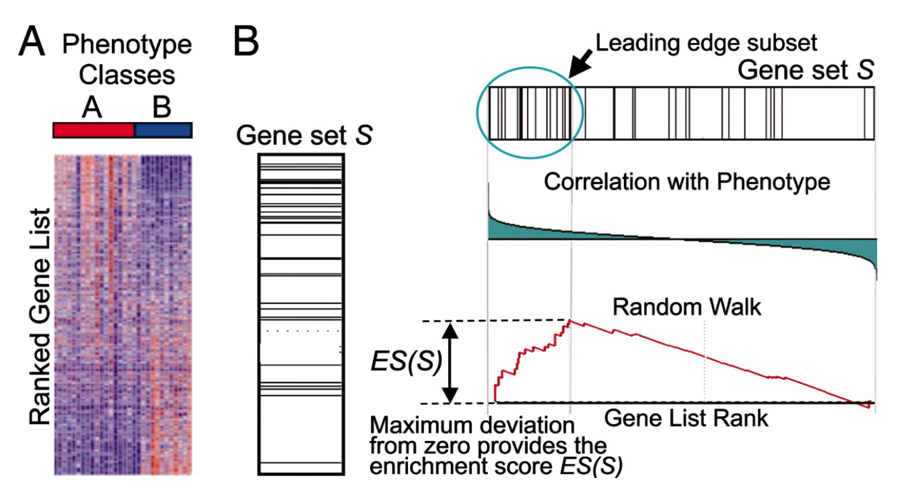
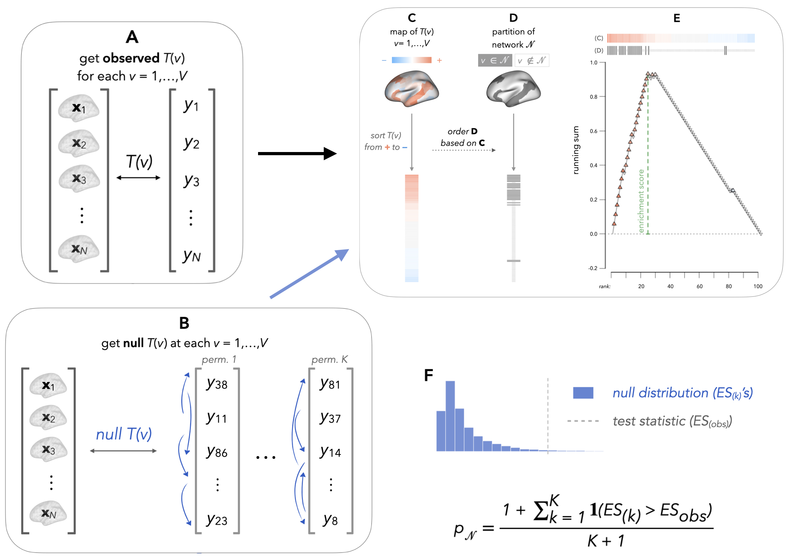
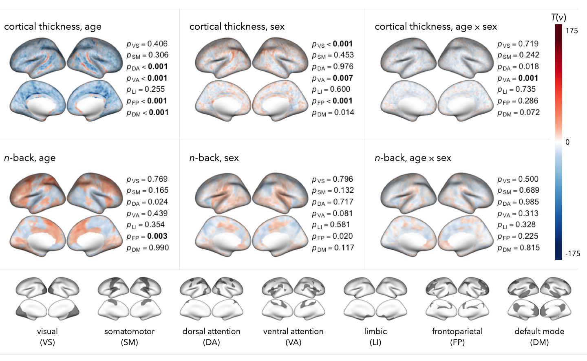
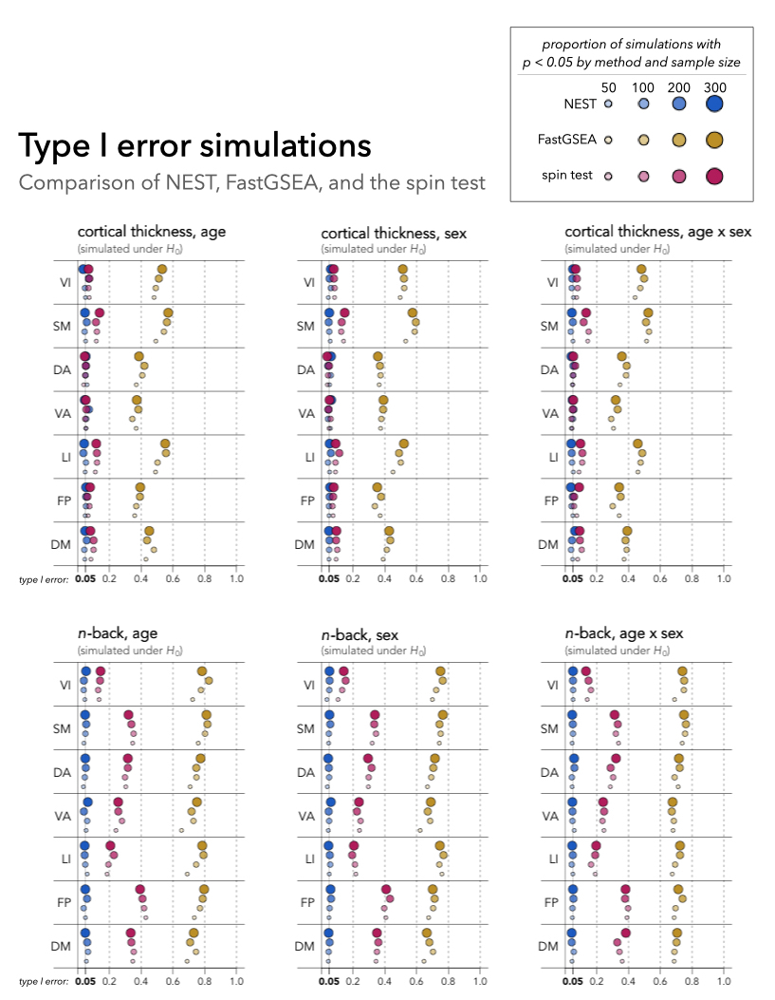

```{r Introduction Video, echo = FALSE}
# will be updated soon! 
# vembedr::embed_url("")
```


# Introducing NEST method

Quantifying and spatially mapping brain-phenotype associations is a central component of many neuroimaging studies. 
There is often particular interest in interpreting these maps through the lens of canonical functional networks, which delineate areas of the brain known to participate in different behaviors and cognitive functions ([yeo et al.](https://doi.org/10.1152/jn.00338.2011), [schaefer et al.](https://doi.org/10.1093/cercor/bhx179)). 
Evaluating whether brain-phenotype associations are especially strong, or enriched within a network of interest can add to our understanding of the neural mechanisms underlying transdiagnostic psychopathology ([segal et al](https://doi.org/10.1038/s41593-023-01404-6)).

Traditional methods for evaluating enrichment have varied widely in scientific rigor and assumptions, often leading to either subjective interpretations or unrealistic assumptions about the spatial properties of imaging data. 
This variability can result in inflated false positive rates, compromising the reliability of the findings.

To address these issues, the Network Enrichment Significance Testing (NEST) method was proposed as a flexible framework for testing the specificity of brain-phenotype associations to functional networks or other brain sub-regions.
By comparing the observed enrichment scores to this null distribution, NEST offers a more reliable test for network specificity, thereby enhancing our understanding of brain-phenotype relationships in the context of functional networks.
```{r, echo=FALSE, out.width='80%', fig.align='center', fig.cap='Many neuroimaging studies involve interpreting maps of brain-phenotype associations through the lens of functional networks, but null hypotheses haven’t been well-defined, and methods are often ad hoc or rely on strong assumptions.​​'}

```

## Gene Set Enrichment Analysis

The idea for the method comes from one of the most widely used methodologies in genomics research, gene set enrichment analysis (GSEA)​.

In a typical GSEA, researchers correlate mRNA expression profiles for many genes with a phenotype, such as tumor sensitivity to a drug. 
The null hypothesis ($H_0$) is that the correlations for genes in a specific set ($S$) are no higher than for genes outside that set, considering the absolute value of correlations.

Brief Overview:

- Sorting Correlations: The correlations are sorted in descending order, with positive correlations at the top and negative correlations at the bottom. The enrichment score ($ES$) quantifies the extent to which genes in the set S appear at the top or bottom of the list.

- Null Distribution: The null distribution is obtained by calculating the ES after permuting the samples (i.e., subjects).

```{r, echo=FALSE, out.width='80%', fig.align='center', fig.cap='Gene Set Enrichment Analysis (GSEA) - Subramanian et al. (2005)​​'}

```

## GSEA -> NEST

By adapting GSEA to the neuroimaging context through NEST, we can more accurately test the specificity of brain-phenotype associations to functional networks without compromising the spatial integrity of the data.

For a given brain–phenotype association (e.g., cortical thickness, age) and pre-specified set of network indices $N \subseteq \{1, \dots, V\}$, we propose the following adaptation of [Subramanian et al.](https://doi.org/10.1073/pnas.0506580102)'s GSEA for NEST.

1. Quantify brain–phenotype associations $T(v)$ at each location ($v = 1,\dots,V$). The choice of metric is up to the researcher (e.g., partial correlation, regression coefficient estimates, etc.) [*](#correlation).

2. Sort the $T(v)$ in descending order, so that the $v$'s with the strongest positive brain–phenotype associations appear at the top of the list, and vertices with strongest negative associations appear at the bottom of the list. 

3. In the sorted list of brain–phenotype associations, we identify the $T(v_{(j)})$'s' where $v_{j} \in N$'s where $v_{(j)} \in N$.

4. Initialize a running sum metric for network $N$ at 0 ($RS_{(0)} = 0$). Begin walking down the list for $j = 1,\dots, V$, calculating the running sum [*](#es).

5. Compute the enrichment score ($ES$) for network $N$ as the maximum deviation from zero that $RS$ takes on.

6. For $k = 1,\dots,K$ permutations (e.g., $K = 999$), permute the phenotype across individuals and quantify brain-phenotype associations $T(v)$ at each location in the permuted sample. Repeat steps 2-5, denoting the ES from the $k$th permutation by $ES^{(k)}$.

7. Estimate a $p$-value for evaluating enrichment of brain-phenotype associations in network $N$ [*](#pval). 
<!-- Comment on why this null distribution makes sense​
When we permute the phenotype across people, we’re destroying any real association between the image and the phenotype throughout the image​
So when we sort the association metrics, network members shouldn’t be more likely to appear at the top/bottom of that list, and the enrichment scores in the null setting would be deflated relative to a setting where there really is enrichment -->

```{r, echo=FALSE, out.width='80%', fig.align='center', fig.cap='Illustration of NEST, which adapts GSEA to test network enrichment in brain-phenotype association studies.​​'}

```

# Implementations in R

## Prepare the data 

Due to privacy regulationswe, we will not provide the data. Both brain imaging and phenotypic data used for the NEST method should be prepared or downloaded by users. For demostration, we use cifti data from hcp tutorial data. 
This open access dataset has been made freely available to the research community by the [WU-Minn HCP consortium](http://www.humanconnectome.org/).

HCP Tutorial data (brain and phenotype data, account required), Connectome workbench can be downloaded [here](https://www.humanconnectome.org/software/get-connectome-workbench).

Parcellation data (network labels) can be found [here](https://github.com/ThomasYeoLab/CBIG/tree/master/stable_projects/brain_parcellation/Schaefer2018_LocalGlobal).

```{r}
library(ciftiTools)
library(parallel)

# Set the path to the Connectome Workbench (adjust the path as per your installation)
wb_path <- "G:/workbench"
ciftiTools.setOption("wb_path", wb_path)

# Read a CIFTI file
cifti_file <- "./data/Q1-Q6_R440.All.corrThickness.32k_fs_LR.dscalar.nii"
cifti_data <- read_cifti(cifti_file)

# Print the shape of data
print(dim(cifti_data$data$cortex_left))
print(dim(cifti_data$data$cortex_right))

X <- rbind(cifti_data$data$cortex_left, cifti_data$data$cortex_right)

# Visualize the CIFTI data
plot(cifti_data)
```


## Quantifying the brain-phenotype correlation {#correlation}

We quantify associations at the vertex level for cortical thickness and $n$-back with age, sex, and the interaction between age and sex using the coefficients of linear models. (Brain-pheonotype associations can be estimated by many methods/models.)

$$
X=Ty+ \gamma Z
$$

where

- X: N x P matrix of P imaging features (e.g., vertices) for N participants.

- y: N-dimensional vector of the phenotype of interest (i.e., testing enrichment of X-y associations).

- Z: Optional. Specify one or more covariates (matrix with N rows and q columns for q covariates). The efault is NULL (no covariates to be included).

The following function fits the vertex-wise linear regression model to estimate local brain-phenotype associations $T(v)$. This will be called by NEST() if NEST argument `statFun`==“lm”

- `X` n x p matrix (n = number of subjects, p = number of image locations)

- `y` vector length n with phenotype measurements for each subject

- `Z` vector (length n) or matrix (number of rows = n) with covariates to be adjusted for in lm. default Z = 1 assumes no covariates (i.e. Z=1 becomes placeholder for the intercept)

- `type` type of statistic from lm() output to use. default is coefficient (will be the coefficient associated with phenotype variable y)

- `n.cores` for parallelization, number of cores to use (default is 1 / no parallelization)

- `seed` optional to set seed to generate random number for permutations

- `FL` whether to use Freedman-Lane approach to permutation. default is FALSE. this option may be preferable if phenotype/covariates are not independent

- `n.perm` number of permutations to conduct for inference. default is 999 (i.e. minimum p-value 1/1000)

- `getNull` whether to obtain null distribution vs. just get observed map of statistics. default will be TRUE inside NEST function, but the statFun function will then be recursively called to get null distribution and getNull will then switch to FALSE
```{r}
statFun.lm = function(X, y, Z = 1, type = "coef", n.cores = 1, seed = NULL, FL = FALSE, n.perm = 999, getNull = TRUE){

  # determine what column from summary(lm()) output will need to be extracted to match 'type' (if none of the options below are specified, will default to coef)
  type.ind = ifelse(type=="coef", 1, # summary(lm(X[,v] ~ y + Z))$coefficients["y",1] = coefficient
                    ifelse(type == "tvalue", 3, # summary(lm(X[,v] ~ y + Z))$coefficients["y",3] = t-value
                           ifelse(type == "pvalue", 4, # summary(lm(X[,v] ~ y + Z))$coefficients["y",4] = p-value
                                  1))) # revert to coef if unspecified

  # pre-specify the permutations (i.e. do the same permutations of people across vertices)
  if (getNull == TRUE){
    if (!is.null(seed)){ set.seed(seed)}
    perm.ind = lapply(1:n.perm, FUN = function(k){
      sample(1:nrow(X), replace = F)
    })
  }

  if (FL == FALSE){ # no freedman-lane (assume independence between y and Z)
    stat.obs = unlist(mclapply(1:ncol(X), FUN = function(v){
      # observed statistic:
      fullmod = lm(X[,v] ~ y + Z)
      obs.stat.v = summary(fullmod)$coefficients["y",type.ind]

      return(obs.stat.v)

    }, mc.cores = n.cores))

    if (getNull == TRUE){ # recursive function used below -- specifying getNull = FALSE so that we don't get a null distribution for the null iterations
      stat.null = lapply(1:n.perm, FUN = function(k){
        statFun.lm(X = X, y = y[perm.ind[[k]]], Z = Z, type = type, n.cores = n.cores, seed = seed, FL = FALSE, getNull = FALSE)$T.obs
      })
      return(list(T.obs = stat.obs,
                  T.null = stat.null))
    } else{
      return(list(T.obs = stat.obs))
    }
  }
}
```


## Computing enrichment score {#es}

The running sum is calculating as the following rules:

\begin{equation}\label{eq:RS}
    RS_{(0)} = 0

    RS_{(j)} = \begin{cases}
        RS_{(j - 1)} + \frac{\mid T(v_{(j)}) \mid }{\sum_{v \in N} \mid T(v) \mid } & \text{ if } v_{(j)} \in N \\
        RS_{(j - 1)} - \frac{1}{\#N^c} & \text{ if } v_{(j)} \in N^c
    \end{cases}
\end{equation}

and we take the enrichment score $ES$ by

\begin{equation}\label{eq:ES}
    ES = \max_{j = 1,\dots,V} \mid RS_{(j)} \mid.
\end{equation}

The following function calculates enrichment score given a map of brain-phenotype associations & network labels

- `stat.map` - vector (length V) of location (v)-specific associations

- `net.map` - vector (also length V) consisting of all 0's, 1's. It is assumed that 1's denote locations inside the network of interest, and 0's denote all other locations

- `one.sided` - default is TRUE, so that the running sum statistic increases in increments proportional to the magnitude of T(v) at a given location in the network; setting one.sided = FALSE will change the increment for locations in the network to increase by 1/(# locations in network)

- `save.detail` - default is FALSE, so that the calculated enrichment score is the only information returned. it can be set to FALSE to return additional information used to calculate the enrichment score

```{r}
enrichScore = function(stat.map, net.map, one.sided = TRUE, save.detail = FALSE){

  V = length(stat.map) # number of locations (e.g., vertices)

  # sort stat.map (strong positive to strong negative)
  stat.map.order = order(stat.map, decreasing = TRUE)
  stat.map.sorted = stat.map[stat.map.order]

  net.map.sorted = net.map[stat.map.order]

  # p.hit = running sum increment when there is a 'hit' (location in network)
  if (one.sided == TRUE){ # one-sided test is default -- test whether stat values inside network are 'more extreme' than those outside the network
    p.hit.numerator = cumsum(abs(stat.map.sorted)*net.map.sorted)
  } else{ # two-sided setting -- test whether statistic differs (in distribution) inside vs. outside the network; no distinction between enrichment vs. under-enrichment
    p.hit.numerator = cumsum(net.map.sorted) #cumsum(rep(1, length(stat.map.sorted)))
  }
  p.hit = p.hit.numerator/p.hit.numerator[V]

  # p.miss = running sum increment when there is a 'miss' (location not in network)
  p.miss.numerator = cumsum(1-net.map.sorted)
  p.miss = p.miss.numerator/p.miss.numerator[V]

  running.sum = p.hit - p.miss

  # ES = enrichment score (test statistic for NEST)
  ES = max(abs(running.sum))

  if (save.detail == FALSE){
    return(ES)
  } else{
    return(list(ES = ES,
                p.hit = p.hit,
                p.miss = p.miss,
                running.sum = running.sum))
  }
}
```

## Computing p-value {#pval}
The p-value for evaluating can be estimated by comparing $ES^{(obs)}$ to $ES^{(k)}, k = 1,\dots,K$ (distribution of $ES^{(obs)}$ under $H_0$):
\begin{equation}
    p_{N} = \frac{1 + \sum_{k = 1}^K\text{I}_{(ES^{(k)} > ES^{(obs)})}}{K + 1}
\end{equation}

The following pvalFun() helper function calculates a p-value based on user-specified observed statistic and null distribution
- obs - observed statistic (i.e. enrichment score)
- null.dist - null distribution (i.e., enrichment scores under H0, obtained via permutation)

```{r}
pvalFun = function(obs, null.dist){
  K = length(null.dist)
  pval = (1+length(which(null.dist > obs)))/(1+K)
  return(pval)
}
```

# Results & Evaluations
To evaluate the performance of NEST, we use data from the from the Philadelphia Neurodevelopmental Cohort (PNC), a large-scale study of children, adolescents, and young adults between 8 and 21 years of age. ([ref](https://doi.org/10.1016/j.neuroimage.2015.03.056))

```{r, echo=FALSE, out.width='80%', fig.align='center', fig.cap='Results from application of NEST to evaluate network enrichment of associations between cortical thickness or $n$-back with age, sex, or age $\times$ sex interactions.​​'}

```

```{r, echo=FALSE, out.width='80%', fig.align='center', fig.cap='Results from application of NEST to evaluate network enrichment of associations between cortical thickness or $n$-back with age, sex, or age $\times$ sex interactions.​​'}

```


# How to use NEST package in R

The implementation of NEST is open-source and available in both R and Python. Researchers can easily use NEST by installing the ready-to-use package through install_github in R or pip in Python. 
This accessibility ensures that researchers can readily apply NEST in their studies to test network specificity of brain-phenotype associations with a robust and reproducible methodology.

The following is a step-by-step guide for implementing NEST in R.

#### Step 1: Install the package

```{r}
if (!require(devtools)){
  install.packages("devtools")
}
devtools::install_github("smweinst/NEST")
library(NEST)
```

#### Step 2: Prepare the data

Import necessary libraries for NEST:

parallel for efficient parallel computing across multiple processor
cores or machines to speed up computations.

```{r}
library(parallel)
library(NEST)
```

First load preprocessed brain imaging data and phenotype (e.g., demographic or diagnosis) information:

- Brain imaging data (e.g., freesurfer or cifti data) is loaded

- Network labels (network_labels) are loaded from yeo_7 network and
  filtered to remove unspecified indices (-1).

- A list (net) of a vector (net_7) is created for the specific default
  network, indicating vertex membership.

```{r, eval=FALSE}
cifti_data <- load_dataset() # (replace with code to load your data)
network_labels <- load_yeo_7() # (replace with code to load your network labels)
idx <- which(network_labels != -1) # identify which locations should be ignored (e.g., medial wall)
network_label <- network_label[idx] # remove labels outside idx
X <- cifti_data[, idx] # subset image (X) locations to idx
net_7 <- as.integer(network_label == 7) # create a binary vector with 1's at locations corresponding to network 7 and 0's at locations outside network 7

# List networks of interest (could be more than one)
net <- list(
    Default <- net_7 
)
```

- Phenotype of interest (y) and covariates (Z)

```{r, eval=FALSE}
y <- load_y() # replace with code to load your phenotype (e.g., age)
Z <- load_Z() # replace with code to load other covariates/confounders (e.g., sex)
```

After loading the data, we recommend checking that the dimensions of your input data are correct:
- dimension of `X` should be N x P (number of participants x number of image locations)

- dimension of phenotype vector `y` should be N

- dimensions of covariate/confounder vector or matrix `Z` should be `N` (x however many covariates you're adjusting for)

#### Step 3: Define the following dictionary of arguments passed to the nest method. The args can be defined as follows, assuming vertex-wise linear models will be fit to estimate local brain-phenotype associations (i.e., specifying statFun=“lm” in step 4.).
- `X`: N x P matrix of P imaging features (e.g., vertices) for N
  participants
- `y`: N-dimensional vector of the phenotype of interest (i.e., testing
  enrichment of X-y associations).
- `Z`: Optional. Specify one or more covariates (matrix with N rows and q
  columns for q covariates). Default is NULL (no covariates to be
  included).
- `FL`: Optional. Default is FALSE, set to TRUE to use the Freedman-Lane
  procedure to account for dependence between covariates in permutation.
- `n.perm`: Optional. Default is 999, with the smallest possible p-value
  of 1/1000.

```{r, eval=FALSE}
args.lm <- list(
    X = X, # brain measurements (dimension N subjects x P image locations)
    y = y, # phenotype of interest (dimension N)
    Z = Z, # covariates (dimension (N x # number of covariates)
    type = "coef", # what type of test statistic to extract from linear regression model (note: if using a different type of model for statistic, this may be different. see source code)
    n.perm = 999 # how many permutations to use to obtain null distribution
)
```
Note: non-linear regression-based statistics can also be used. This example is just for the regression-based statistic.

#### Step 4: Apply NEST to test enrichment of brain-phenotype associations in specified networks.
Arguments for NEST function: 
- `statFun`: specify the method to get vertex-level test statistics (e.g., "lm"). Must correspond to a statFun R script (e.g., statFun.lm.R or statFun.gam.mvwald.R, or another one customized by the user)

- `args`: arguments needed for whatever was specified as statFun

- `net.maps`: list of binary vector(s) indicating locations inside (1) or outside (0) network(s) of interest.

- `one.sided`: Specifies whether test is one-sided (one.sided=TRUE) or two-sided (one.sided = FALSE)
    - In a one-sided test, we test whether T(v) are *more extreme* in vs. outside the network
    - In a two-sided test, we test whether the distribution of T(v) is *different* in vs. outside the network.
    - Note: default is one.sided = TRUE, which is consistent with implementation used in the paper.

- `n.cores`: specify the number of CPU cores to be employed for parallel processing tasks within the function

- `seed`: random seed for reproducible permutation. Default is NULL, but we recommend setting one.

- `what.to.return`: specify what values to return. "everything" will include p-value, enrichment score, null distribution, etc. If left unspecified, the default is to return only the p-value for each network.
```{r, eval=FALSE}
out <- NEST(statFun = "lm",
            args = args.lm, # arguments defined above (specific to statFun="lm" setting)
            net.maps = net, 
            one.sided = TRUE,
            n.cores = 1, 
            seed = 10, 
            what.to.return = "everything")

```

# Additional resources

Tutorial for using NEST in Python is available at [here](https://github.com/smweinst/NEST/blob/main/Python/example.ipynb).

More information: [here](https://smweinst.github.io/nest-method/)

[Link to our paper](https://doi.org/10.1002/hbm.26714)

Feel free to reach out with any comments/questions!
